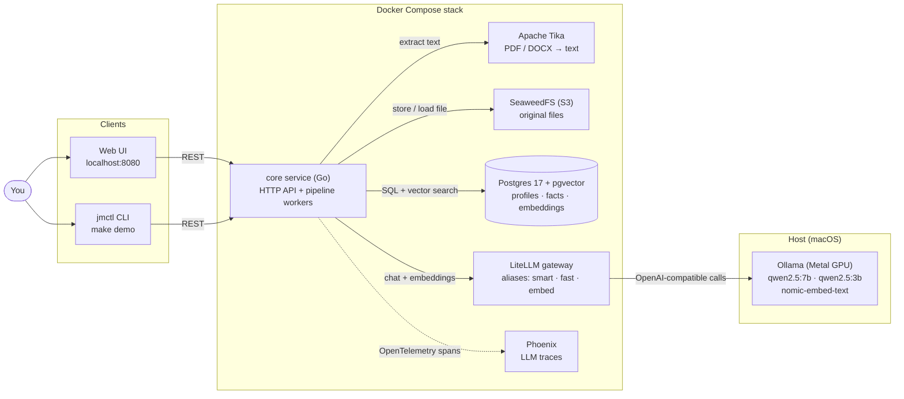
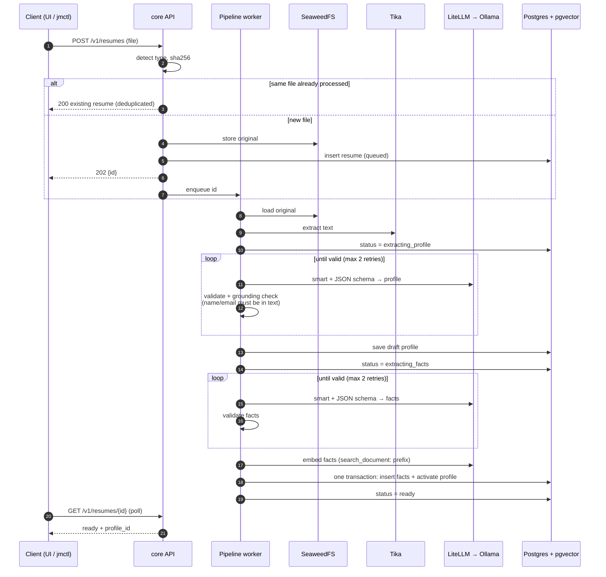
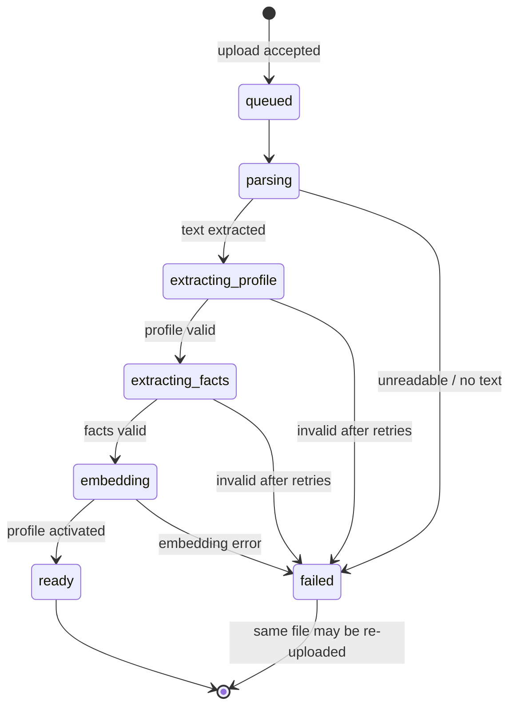
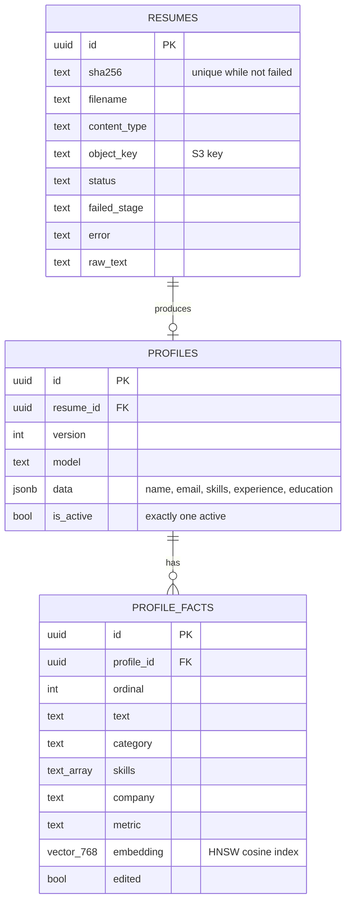
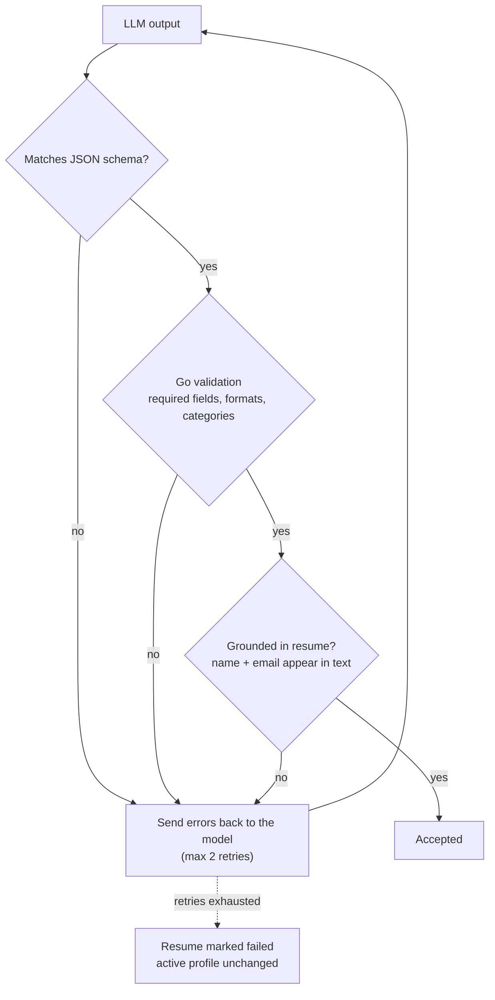
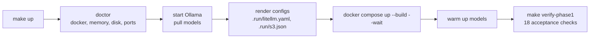

# Architecture (Phase 1)

JobMatcher runs entirely on your machine. Everything except the model runtime runs in
Docker; on macOS Ollama runs natively so models can use the Apple GPU (Metal).

## System overview

Services only ever call **model aliases** on the gateway (`smart`, `fast`, `embed`), never a
concrete model or Ollama directly. Swapping a model is a change to `.env`.

## Resume pipeline

An upload returns immediately (`202 Accepted`); a worker processes it in the background and
the client polls the status.

## Resume states

On restart, any resume not in `ready` or `failed` is re-queued and processed from the start
(at-least-once). A shutdown never marks work as failed.

## Data model

## How quality is enforced

Temperature 0 and a fixed seed keep extraction reproducible. Acceptance tests then check
quality against golden fixtures with thresholds: skill recall ≥ 80%, company recall 100%,
≥ 90% of numbers in facts present in the resume, and search recall@3 ≥ 2/3.

## Run and verify

